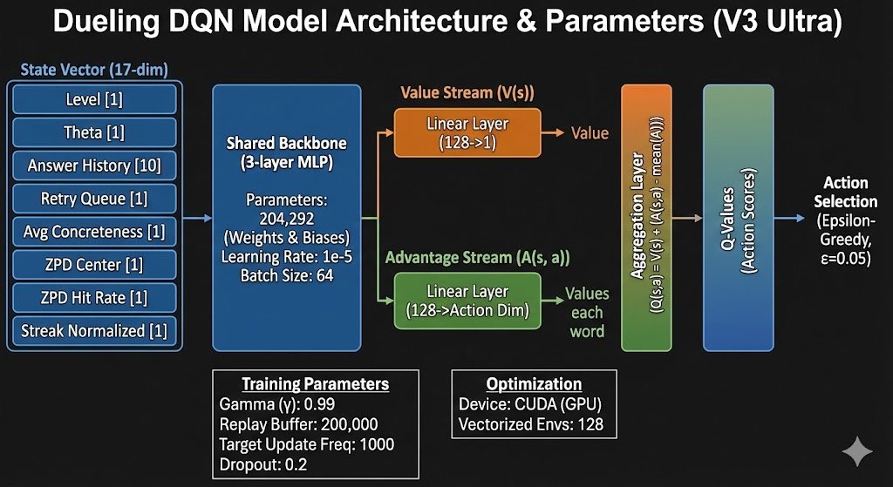
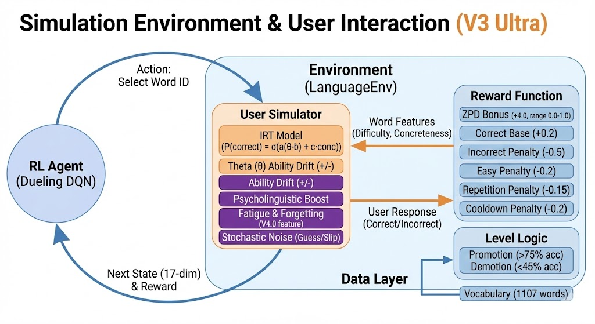

# RL-Based Adaptive Language Learning System

[](README.md)
[](README.tr.md)

An intelligent reinforcement learning system that personalizes vocabulary learning by adapting to individual learner abilities using Item Response Theory (IRT) and advanced RL algorithms.

## What This Model Does

This system acts as an **AI tutor** that:
- **Selects optimal vocabulary words** based on learner's current ability
- **Targets the Zone of Proximal Development (ZPD)** - presenting words that are challenging but not too difficult
- **Adapts in real-time** using reinforcement learning to maximize learning efficiency
- **Simulates realistic learner behavior** with cognitive models (fatigue, motivation, forgetting)

**Key Achievement:** 53.8% ZPD hit rate (target was 30-40%) with 59% accuracy

---

## Model Architecture

### Neural Network Structure

*Dueling DQN with separate value and advantage streams*

### System Flow Diagram

*Complete data flow from agent to environment to user simulation*

---

## Training Results

### Overall Performance

*Episode rewards, accuracy, ZPD hits, and episode lengths over 1024 episodes*

### Learning Progress

*Cumulative reward and accuracy trend showing learning improvement*

### ZPD Analysis

*ZPD hit rate distribution and correlation with accuracy*

### Metric Distributions

*Reward, accuracy, and ZPD hit distributions*

---

## Core Files Overview

### Model & Agent
- **`models_v3.py`** - Dueling Double DQN agent with prioritized replay
  - State: 17 features (ability, history, ZPD center, streak, etc.)
  - Action: Select next word to present
  - Reward: Correct answers + ZPD targeting bonus

### Environment
- **`language_env_v3.py`** - Single environment with anti-repetition system
  - Tracks word history, cooldowns, and diminishing returns
  - Prevents agent from exploiting word repetition
  - Implements realistic reward clipping
  
- **`language_env_vectorized.py`** - Vectorized parallel environments (128x)
  - Critical fix: Proper reward accumulation
  - 30x faster training through batched operations
  - NumPy-optimized for CPU efficiency

### User Simulation
- **`user_simulator.py`** - Basic IRT model (simple probability)
  
- **`user_simulator_realistic.py`** - Advanced simulation with 6 cognitive models:
  1. **Slip & Guess** (4PL IRT) - Know but fail, or guess correctly
  2. **Fatigue** - Performance degrades over time
  3. **Motivation** - Success/failure affects engagement
  4. **Variable Learning** - Adaptive learning rates
  5. **Forgetting** - Spaced repetition memory decay
  6. **Response Noise** - Human-like variability

- **`user_simulator_vectorized.py`** - Vectorized version for parallel training

### Configuration
- **`config.py`** - All hyperparameters and reward structure
  - Anti-repetition penalties (rebalanced)
  - ZPD reward bonuses
  - DQN training parameters
  - Reward clipping limits

### Training
- **`train_v3_ultra_final.py`** - Main training script
  - 128 parallel environments
  - GPU-accelerated
  - Automatic visualization generation
  - ~14 minutes for 1000 episodes

### Visualization
- **`training_plots.py`** - Auto-generates 4 detailed plots:
  - Training overview (rewards, accuracy, ZPD)
  - Learning curves
  - ZPD analysis
  - Distribution histograms

### Data
- **`vocabulary_data.py`** - Turkish-English vocabulary dataset loader
  - 1,105 words with CEFR difficulty levels
  - Concreteness ratings
  - Word feature extraction

### Utilities
- **`prioritized_replay.py`** - Prioritized Experience Replay buffer
- **`test_reward_accum.py`** - Test for reward accumulation bug fix

---

## System Architecture

```
┌─────────────────────────────────────────────────────────┐
│                   DQN Agent (models_v3)                 │
│  ┌──────────────────────────────────────────────────┐  │
│  │ State (17D) → Dueling Network → Q-Values         │  │
│  │ • User ability (θ)                                │  │
│  │ • Answer history (10 answers)                     │  │
│  │ • ZPD center                                      │  │
│  │ • Current streak                                  │  │
│  └──────────────────────────────────────────────────┘  │
└─────────────────────────────────────────────────────────┘
                          ↓ Action: Select word
┌─────────────────────────────────────────────────────────┐
│          Environment (language_env_vectorized)          │
│  ┌──────────────────────────────────────────────────┐  │
│  │ • Anti-repetition tracking                        │  │
│  │ • ZPD calculation                                 │  │
│  │ • Reward computation                              │  │
│  └──────────────────────────────────────────────────┘  │
└─────────────────────────────────────────────────────────┘
                          ↓ Word presented
┌─────────────────────────────────────────────────────────┐
│      Realistic User (user_simulator_realistic)          │
│  ┌──────────────────────────────────────────────────┐  │
│  │ IRT + Slip/Guess + Fatigue + Motivation +         │  │
│  │ Forgetting + Noise → Correct/Incorrect            │  │
│  └──────────────────────────────────────────────────┘  │
└─────────────────────────────────────────────────────────┘
                          ↓ Response + Reward
                    ┌──────────────┐
                    │ Replay Buffer │
                    │ (Prioritized) │
                    └──────────────┘
```

---

## Quick Start

### Training
```bash
# Train new model (128 parallel envs, CUDA)
python train_v3_ultra_final.py --episodes 1000 --num-envs 128 --device cuda

# Results saved to:
# - checkpoints/v3_ultra_final.pt (model)
# - plots_v3_final/*.png (4 graphs)
```

### Testing
```bash
# Quick demo
python quick_demo.py

# Interactive quiz
python interactive_demo.py

# Test reward accumulation
python test_reward_accum.py
```

### Using Trained Model
```python
from models_v3 import DuelingDQNAgent
from vocabulary_data import VocabularyDataset

# Load model
vocab = VocabularyDataset()
agent = DuelingDQNAgent(state_dim=17, vocab_dataset=vocab)
agent.load('checkpoints/v3_ultra_final.pt')

# Get word recommendation
state = env.get_state()
available_words = env.get_available_actions()
action = agent.select_action(state, available_words, estimated_theta=0.5)
```

---

## Performance Metrics

### Final Results (1024 episodes)
```
ZPD Hit Rate:      53.8%  (Target: 30-40%)
Average Accuracy:  58.1%  (Realistic with cognitive models)
Average Reward:    59.31  (per episode)
Training Speed:    14 minutes / 1024 episodes
```


## Key Features

### Anti-Repetition System (3 Mechanisms)
1. **Recent Penalty:** -0.15 per occurrence in last 10 words
2. **Cooldown:** -0.2 if shown within 5 steps
3. **Diminishing Returns:** ZPD bonus decreases with repetition

### Realistic Simulation
- **Slip:** 15% chance to fail despite knowing
- **Guess:** 25% chance to succeed despite not knowing
- **Fatigue:** -2% energy per question
- **Forgetting:** 28% memory decay after 20 steps

### Reward Structure
```
Base reward:     +0.15 (correct) / -0.03 (incorrect)
ZPD bonus:       +1.0 (in ZPD) + 1.5 (correct in ZPD)
Streak bonus:    +0.08 per correct (max 5)
Novel word:      +0.15 (first time in episode)
Clipped to:      [-0.5, 3.0] per step
```

---

## Dependencies

```bash
pip install torch numpy pandas tqdm matplotlib gymnasium
```

**Requirements:**
- Python 3.8+
- CUDA (optional, for GPU acceleration)
- ~2GB RAM for training
- ~500MB for model weights

---

## Documentation

- **`README.tr.md`** - Turkish version of this document
- **`walkthrough.md`** - Complete Turkish documentation (all changes)
- **`REWARD_BUG_FIX.md`** - Reward accumulation bug fix details
- **`GPU_OPTIMIZATION_DOCS.md`** - Performance optimization guide
- **`DEMO_USAGE.md`** - Demo script usage instructions

---


