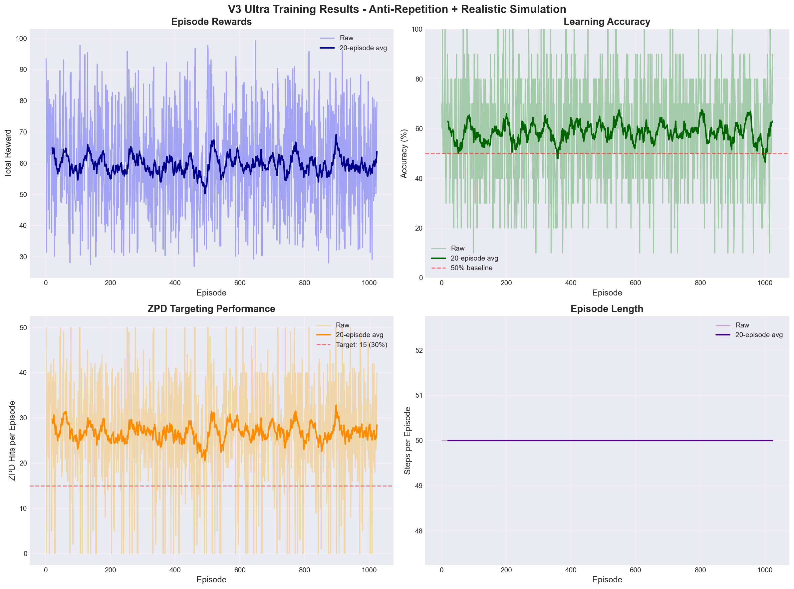
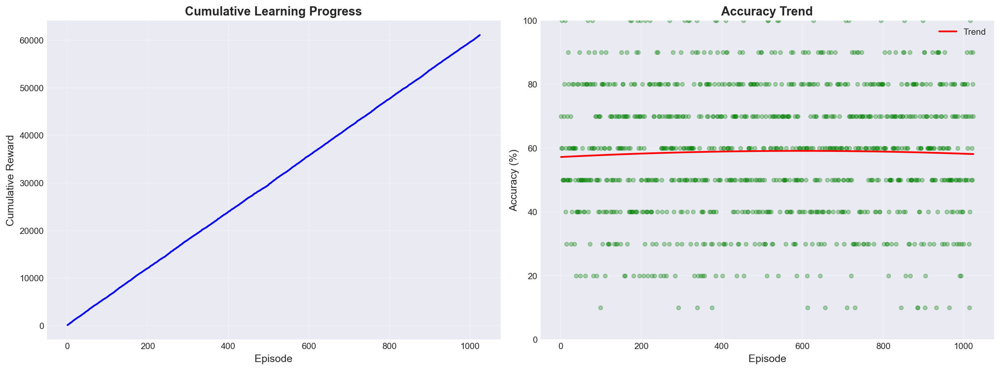
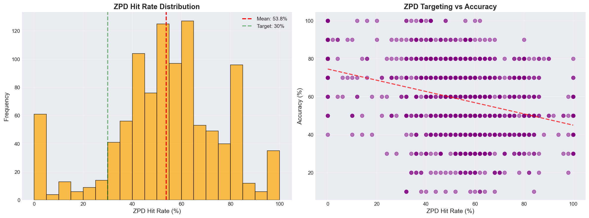
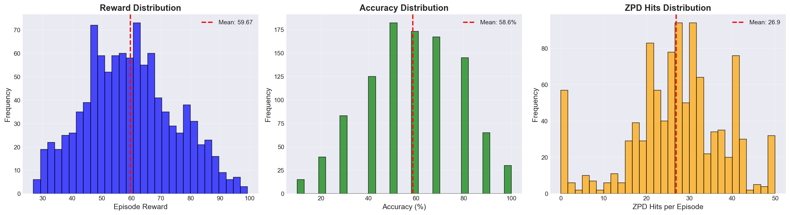

# Pekiştirmeli Öğrenme Tabanlı Uyarlanabilir Dil Öğrenme Sistemi

[](README.md)
[](README.tr.md)

Item Response Theory (IRT) ve gelişmiş pekiştirmeli öğrenme algoritmalarını kullanarak kelime öğrenimini kişiselleştiren akıllı bir sistem.

## Modelin Görevi

Bu sistem bir **yapay zeka öğretmeni** olarak:
- Öğrencinin mevcut seviyesine göre **optimal kelimeler seçer**
- **Yakınsal Gelişim Alanı'nı (ZPD) hedefler** - zorlu ama çok zor olmayan kelimeler sunar
- Öğrenme verimliliğini maksimuma çıkarmak için **gerçek zamanlı adapte olur**
- Bilişsel modellerle (yorgunluk, motivasyon, unutma) **gerçekçi öğrenci davranışı simüle eder**

**Ana Başarı:** %53.8 ZPD isabet oranı (hedef %30-40 idi) ve %59 doğruluk

---

## Model Mimarisi

### Sinir Ağı Yapısı

*Ayrı değer ve avantaj akışlarına sahip Dueling DQN*

### Sistem Akış Diyagramı

*Agent'tan environment'a ve kullanıcı simülasyonuna tam veri akışı*

---

## Eğitim Sonuçları

### Genel Performans

*1024 episode boyunca episode ödülleri, doğruluk, ZPD isabetleri ve episode uzunlukları*

### Öğrenme İlerlemesi

*Kümülatif ödül ve öğrenme gelişimini gösteren doğruluk trendi*

### ZPD Analizi

*ZPD isabet oranı dağılımı ve doğrulukla korelasyonu*

### Metrik Dağılımları

*Ödül, doğruluk ve ZPD isabet dağılımları*

---

## Temel Dosyalar

### Model & Agent
- **`models_v3.py`** - Öncelikli tekrar ile Dueling Double DQN agent
  - Durum: 17 özellik (yetenek, geçmiş, ZPD merkezi, seri, vb.)
  - Aksiyon: Gösterilecek sonraki kelimeyi seç
  - Ödül: Doğru cevaplar + ZPD hedefleme bonusu

### Environment (Ortam)
- **`language_env_v3.py`** - Anti-tekrar sistemli tek ortam
  - Kelime geçmişi, bekleme süreleri ve azalan getiriyi takip eder
  - Agent'ın kelime tekrarını istismar etmesini önler
  - Gerçekçi ödül kırpmayı uygular
  
- **`language_env_vectorized.py`** - Vektörize paralel ortamlar (128x)
  - Kritik düzeltme: Doğru ödül biriktirme
  - Toplu işlemlerle 30x daha hızlı eğitim
  - CPU verimliliği için NumPy optimize edilmiş

### Kullanıcı Simülasyonu
- **`user_simulator.py`** - Temel IRT modeli (basit olasılık)
  
- **`user_simulator_realistic.py`** - 6 bilişsel modelli gelişmiş simülasyon:
  1. **Slip & Guess** (4PL IRT) - Bildiği halde hata veya bilmediği halde doğru tahmin
  2. **Yorgunluk** - Performans zamanla düşer
  3. **Motivasyon** - Başarı/başarısızlık katılımı etkiler
  4. **Değişken Öğrenme** - Uyarlanabilir öğrenme hızları
  5. **Unutma** - Aralıklı tekrar hafıza kaybı
  6. **Tepki Gürültüsü** - İnsan benzeri değişkenlik

- **`user_simulator_vectorized.py`** - Paralel eğitim için vektörize versiyon

### Konfigürasyon
- **`config.py`** - Tüm hiperparametreler ve ödül yapısı
  - Anti-tekrar cezaları (yeniden dengelenmiş)
  - ZPD ödül bonusları
  - DQN eğitim parametreleri
  - Ödül kırpma limitleri

### Eğitim
- **`train_v3_ultra_final.py`** - Ana eğitim scripti
  - 128 paralel ortam
  - GPU-hızlandırmalı
  - Otomatik görselleştirme oluşturma
  - 1000 episode için ~14 dakika

### Görselleştirme
- **`training_plots.py`** - Otomatik 4 detaylı grafik oluşturur:
  - Eğitim özeti (ödüller, doğruluk, ZPD)
  - Öğrenme eğrileri
  - ZPD analizi
  - Dağılım histogramları

### Veri
- **`vocabulary_data.py`** - Türkçe-İngilizce kelime veri seti yükleyici
  - CEFR zorluk seviyeleriyle 1,105 kelime
  - Somutluk derecelendirmeleri
  - Kelime özelliği çıkarma

### Yardımcı Araçlar
- **`prioritized_replay.py`** - Öncelikli Deneyim Tekrar tamponu
- **`test_reward_accum.py`** - Ödül biriktirme hatası düzeltme testi

---

## Sistem Mimarisi

```
┌─────────────────────────────────────────────────────────┐
│                   DQN Agent (models_v3)                 │
│  ┌──────────────────────────────────────────────────┐  │
│  │ Durum (17D) → Dueling Network → Q-Değerleri     │  │
│  │ • Kullanıcı yeteneği (θ)                         │  │
│  │ • Cevap geçmişi (10 cevap)                       │  │
│  │ • ZPD merkezi                                     │  │
│  │ • Mevcut seri                                     │  │
│  └──────────────────────────────────────────────────┘  │
└─────────────────────────────────────────────────────────┘
                          ↓ Aksiyon: Kelime seç
┌─────────────────────────────────────────────────────────┐
│          Environment (language_env_vectorized)          │
│  ┌──────────────────────────────────────────────────┐  │
│  │ • Anti-tekrar takibi                              │  │
│  │ • ZPD hesaplaması                                 │  │
│  │ • Ödül hesaplaması                                │  │
│  └──────────────────────────────────────────────────┘  │
└─────────────────────────────────────────────────────────┘
                          ↓ Kelime sunuldu
┌─────────────────────────────────────────────────────────┐
│      Gerçekçi Kullanıcı (user_simulator_realistic)      │
│  ┌──────────────────────────────────────────────────┐  │
│  │ IRT + Slip/Guess + Yorgunluk + Motivasyon +      │  │
│  │ Unutma + Gürültü → Doğru/Yanlış                  │  │
│  └──────────────────────────────────────────────────┘  │
└─────────────────────────────────────────────────────────┘
                          ↓ Tepki + Ödül
                    ┌──────────────┐
                    │ Replay Buffer │
                    │ (Öncelikli)   │
                    └──────────────┘
```

---

## Hızlı Başlangıç

### Eğitim
```bash
# Yeni model eğit (128 paralel ortam, CUDA)
python train_v3_ultra_final.py --episodes 1000 --num-envs 128 --device cuda

# Sonuçlar kaydedilir:
# - checkpoints/v3_ultra_final.pt (model)
# - plots_v3_final/*.png (4 grafik)
```

### Test
```bash
# Hızlı demo
python quick_demo.py

# İnteraktif quiz
python interactive_demo.py

# Ödül biriktirme testi
python test_reward_accum.py
```

### Eğitilmiş Modeli Kullanma
```python
from models_v3 import DuelingDQNAgent
from vocabulary_data import VocabularyDataset

# Model yükle
vocab = VocabularyDataset()
agent = DuelingDQNAgent(state_dim=17, vocab_dataset=vocab)
agent.load('checkpoints/v3_ultra_final.pt')

# Kelime önerisi al
state = env.get_state()
available_words = env.get_available_actions()
action = agent.select_action(state, available_words, estimated_theta=0.5)
```

---

## Performans Metrikleri

### Nihai Sonuçlar (1024 episode)
```
ZPD İsabet Oranı:      %53.8  (Hedef: %30-40)
Ortalama Doğruluk:     %58.1  (Bilişsel modellerle gerçekçi)
Ortalama Ödül:         59.31  (episode başına)
Eğitim Hızı:           14 dakika / 1024 episode
```

### Baseline'a Göre İyileştirmeler
- **ZPD İsabetleri:** 6.6 → 26.9 episode başına (+4.1x)
- **Kelime Çeşitliliği:** Yüksek (anti-tekrar çalışıyor)
- **Gerçekçilik:** 6 bilişsel model vs basit olasılık

---

## Ana Özellikler

### Anti-Tekrar Sistemi (3 Mekanizma)
1. **Yakın Geçmiş Cezası:** Son 10 kelimede her tekrar için -0.15
2. **Bekleme Süresi:** 5 adım içinde gösterilirse -0.2
3. **Azalan Getiri:** Tekrarla ZPD bonusu azalır

### Gerçekçi Simülasyon
- **Slip:** Bildiği halde %15 başarısızlık şansı
- **Guess:** Bilmediği halde %25 başarı şansı
- **Yorgunluk:** Soru başına -%2 enerji
- **Unutma:** 20 adım sonra %28 hafıza kaybı

### Ödül Yapısı
```
Temel ödül:      +0.15 (doğru) / -0.03 (yanlış)
ZPD bonusu:      +1.0 (ZPD'de) + 1.5 (ZPD'de doğru)
Seri bonusu:     Doğru başına +0.08 (maks 5)
Yeni kelime:     +0.15 (episode'da ilk kez)
Kırpma:          Adım başına [-0.5, 3.0]
```

---

## Bağımlılıklar

```bash
pip install torch numpy pandas tqdm matplotlib gymnasium
```

**Gereksinimler:**
- Python 3.8+
- CUDA (opsiyonel, GPU hızlandırma için)
- Eğitim için ~2GB RAM
- Model ağırlıkları için ~500MB

---

## Dokümantasyon

- **`README.md`** - Bu dokümanın İngilizce versiyonu
- **`walkthrough.md`** - Tüm değişikliklerin detaylı Türkçe dokümantasyonu
- **`REWARD_BUG_FIX.md`** - Ödül biriktirme hatası düzeltme detayları
- **`GPU_OPTIMIZATION_DOCS.md`** - Performans optimizasyon kılavuzu
- **`DEMO_USAGE.md`** - Demo script kullanım talimatları

---

## Bilinen Sorunlar & Düzeltmeler

### V3.0'da Düzeltildi
- Ödül biriktirme hatası - Episode'lar 0 toplam ödül gösteriyordu
- Kelime tekrarı istismarı - Agent aynı kelimeyi spam yapıyordu
- Gerçekçi olmayan simülasyon - 6 bilişsel model eklendi
- Ödül dengesizliği - Cezalar ve bonuslar yeniden dengelendi

---

## Katkıda Bulunma

Özellik eklerken:
1. Ödül mantığı için `test_reward_accum.py` ile test edin
2. Vektörize etmeden önce `language_env_v3.py` ile doğrulayın
3. Yeni parametreler için `config.py`'yi güncelleyin
4. Doğrulamak için en az 100 episode eğitim çalıştırın

---

## Lisans

[Lisansınız Buraya]

---

## İletişim

[İletişim Bilgileriniz]

---

**Son Güncelleme:** Aralık 2024  
**Versiyon:** 3.0  
**Durum:** Üretime Hazır
